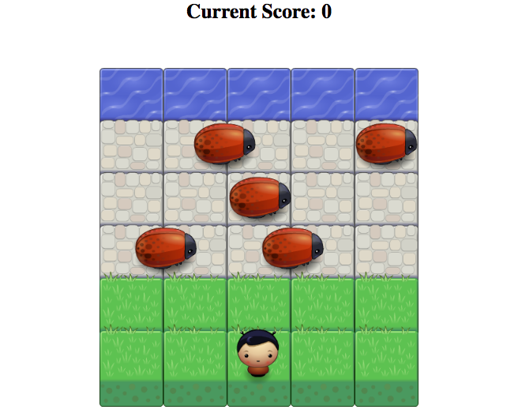

# Frogger Remake Arcade Game
This game is a remake of frogger using a human player and bugs instead of cars

## Arcade Game Preview


## Instructions For Playing Game Live
1. Load the project while on a desktop computer and start playing by going here: [https://imdariusburgan.github.io/frogger-clone-arcade-game/](https://imdariusburgan.github.io/frogger-clone-arcade-game/)
2. Use the 'left', 'up', 'right', and 'down' arrow keys on your keyboard to control the player.
3. Get your player across the road and to the water without getting hit by bugs.
4. Once your score has reached 30, you will win the game.
5. But beware, getting hit by a bug will reduce your score.

## Instructions For Playing Game Locally
1. Download or clone this repository to your local computer.
2. Open the 'index.html' file in your preferred internet browser.
3. Use the 'left', 'up', 'right', and 'down' arrow keys on your keyboard to control the player.
4. Get your player across the road and to the water without getting hit by bugs.
5. Once your score has reached 30, you will win the game.
6. But beware, getting hit by a bug will reduce your score.

## How to add or remove enemies
1. Add enemies by adding this line (fill in the placeholder text with numbers) after line 126 in js/app.js -> 

>```const uniqueNamePlaceholder = new Enemy(starting horizontal location placeholder, starting vertical location placeholder (choose 60, 145, or 225), enemy movement speed placeholder ); ``` 

Then add the variable's unique name to the allEnemies array.

2. Remove enemies by deleting an enemy variable and removing the matching variable from the 'allEnemies' array.

## Resources
1. The code for the 'congratulations, you win' modal was taken from [https://github.com/imdariusburgan/memory-card-game](https://github.com/imdariusburgan/memory-card-game)
2. I used the [MDN docs](https://developer.mozilla.org/en-US/docs/Web/JavaScript/Reference/Global_Objects/Math/abs) to find 'Math.abs()' which allowed me to accurately judge when a player collided with a bug.
3. Starter code, such as the game engine was provided by [Udacity](https://www.udacity.com/)

## License
This repository is licensed under the [MIT License](https://opensource.org/licenses/MIT)